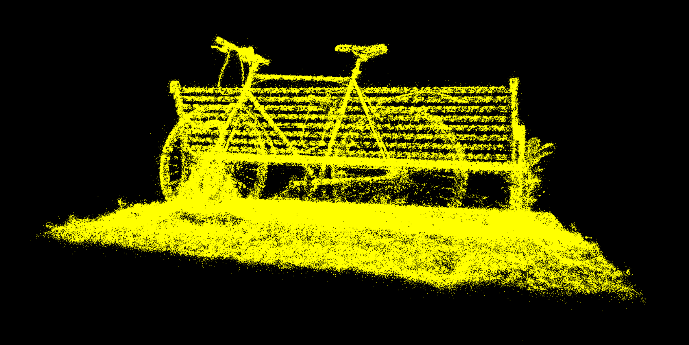

# Project5-WebGPU-Gaussian-Splat-Viewer

**University of Pennsylvania, CIS 565: GPU Programming and Architecture, Project 5**

* Kevin Dong
* Tested on: Google Chrome Version 129.0.6668.101 on
  Windows 11, i7-10750H @ 2.60GHz 16GB, RTX 2060

### Live Demo

[Live Demo](https://kleokhov.github.io/Project5-WebGPU-Gaussian-Splat-Viewer/)

### Demo Video/GIF

### Description
This repo implements a Gaussian Splat Viewer using WebGPU. The viewer allows the user to see the point-cloud rendering 
of a ply file as well as the Gaussian splat rendering of the point cloud.

To create a Gaussian Splatting, we first use the point-cloud shader to blend overlapping Gaussian splats to form a 
continuous surface appearance. Then in the preprocess compute shader, we process the point cloud to generate and 
store the splats. We then apply a radix sort to sort the splats by their screen-space position. Finally, we render the 
splats using the Gaussian splat shader. The technique used in the project is based on the paper *3D Gaussian Splatting
for Real-Time Radiance Field Rendering*.

| Point-Cloud Rendering | Gaussian Splat Rendering |
|-----------------------|--------------------------|
|     |        |

### Performance Analysis

#### Comparison between Point-Cloud and Gaussian Splat Rendering
The Gaussian Splat rendering is much more expensive than the point-cloud rendering. This is because the Gaussian Splat 
rendering requires a preprocessing step to generate the splats and then a sorting step to sort the splats, and the 
alpha blending of the splats is also more expensive than the point-cloud rendering. Therefore, we would expect the 
Gaussian Splat rendering to be slower than the point-cloud rendering.

Visually, the two renderers look very different. The point-cloud renderer only renders all the points in the point 
cloud, but the Gaussian Splat renderer renders a continuous surface appearance. The Gaussian Splat renderer can also 
display more information about the point cloud than the point-cloud renderer.

#### Changing Workgroup Size
Decreasing the workgroup size quickly decreases the performance of the Gaussian Splat renderer, since the workgroup size 
determines the number of splats that are processed in parallel. If the workgroup size is too small, the renderer will 
not be able to process all the splats in parallel, and the performance will decrease. Increasing the workgroup size to be 
higher than the default (256) caused my Guassian Splat renderer to not work, as it exceeds the maximum workgroup size 
allowed by my GPU.

#### View-Frustum Culling
We would expect view-frustum culling to improve the performance of the Gaussian Splat renderer, since it would reduce 
the number of splats that need to be processed. In smaller scenes, view-frustum culling would not have a significant 
impact on the performance of the Gaussian Splat renderer, since the number of splats is already small. The overhead of 
including a view-frustum culling step should be minimal, so it should still be a good idea to include it.

#### Number of Gaussians
Increasing the number of Gaussians should decrease the performance of the Gaussian Splat renderer, since the renderer 
would need to process more splats. On my machine, loading a high scene file will cause the renderer to crash, and the 
loading time increases significantly as the number of Gaussians increases.

### Credits

- [Vite](https://vitejs.dev/)
- [tweakpane](https://tweakpane.github.io/docs//v3/monitor-bindings/)
- [stats.js](https://github.com/mrdoob/stats.js)
- [wgpu-matrix](https://github.com/greggman/wgpu-matrix)
- Special Thanks to: Shrek Shao (Google WebGPU team) & [Differential Guassian Renderer](https://github.com/graphdeco-inria/diff-gaussian-rasterization)
- [Post explaining the preprocessing step](https://github.com/kwea123/gaussian_splatting_notes?tab=readme-ov-file#%EF%B8%8F-forward-pass)
- [Original Implementation in CUDA](https://github.com/graphdeco-inria/diff-gaussian-rasterization/blob/9c5c2028f6fbee2be239bc4c9421ff894fe4fbe0/cuda_rasterizer/forward.cu)
- [Website about the Paper](https://repo-sam.inria.fr/fungraph/3d-gaussian-splatting/)
