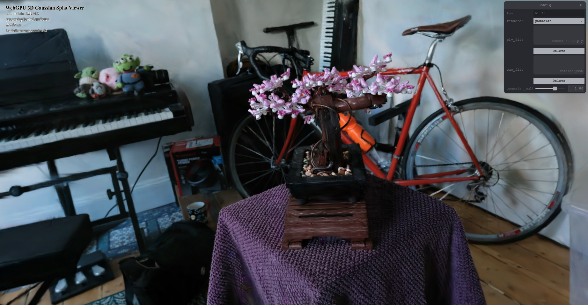
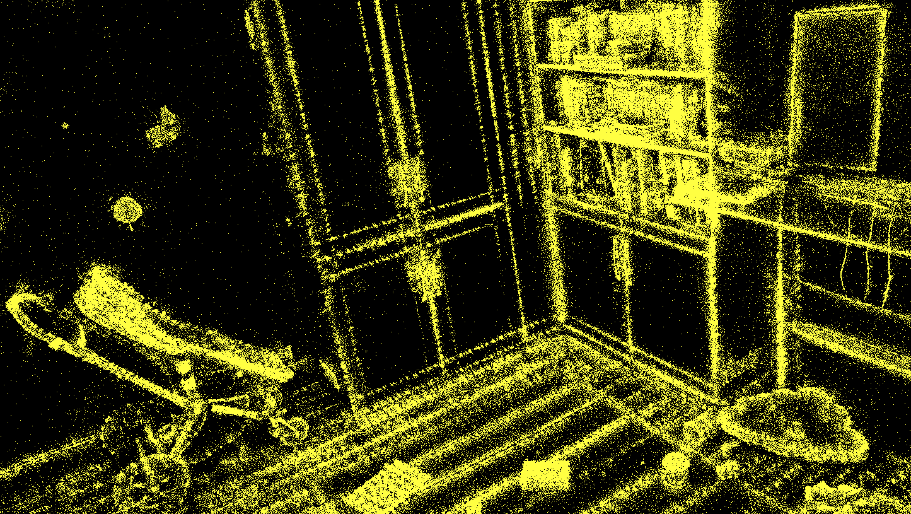
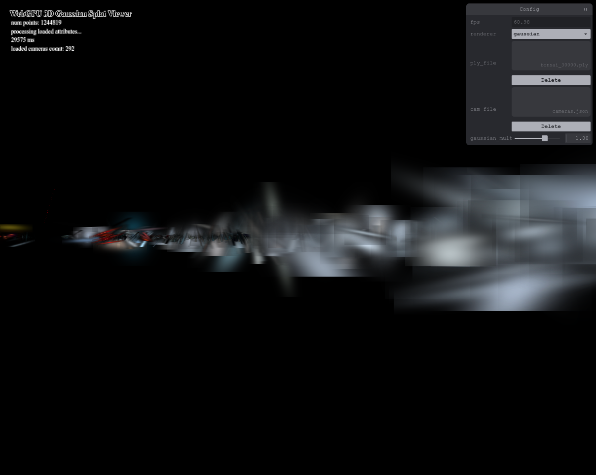
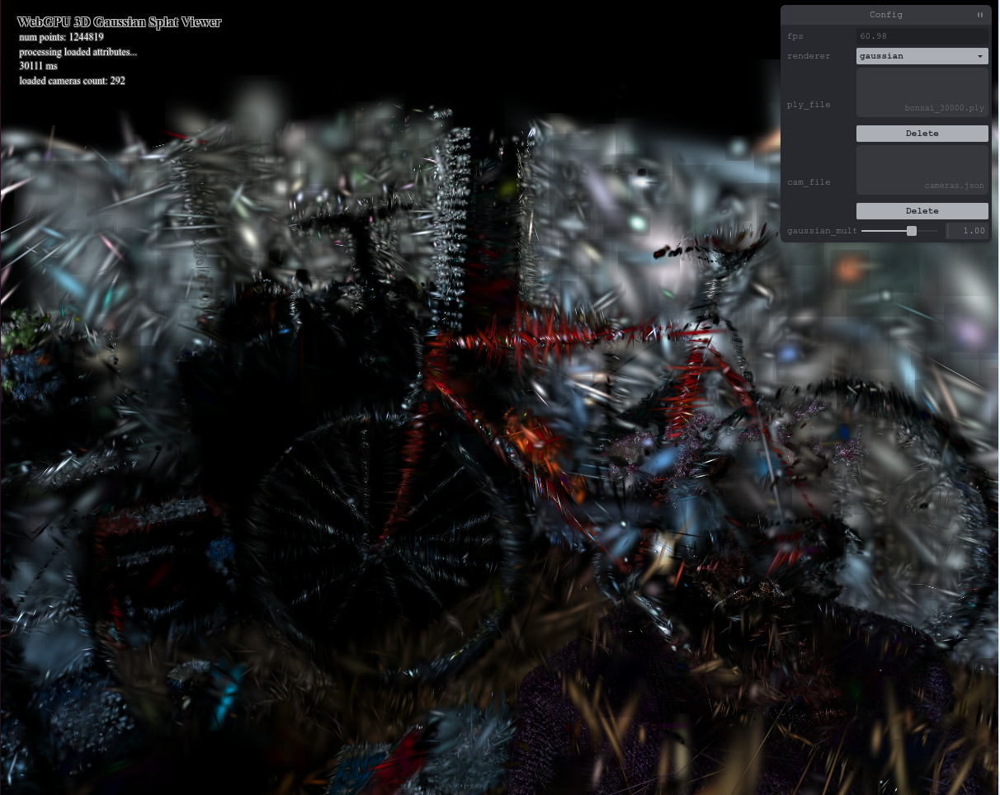
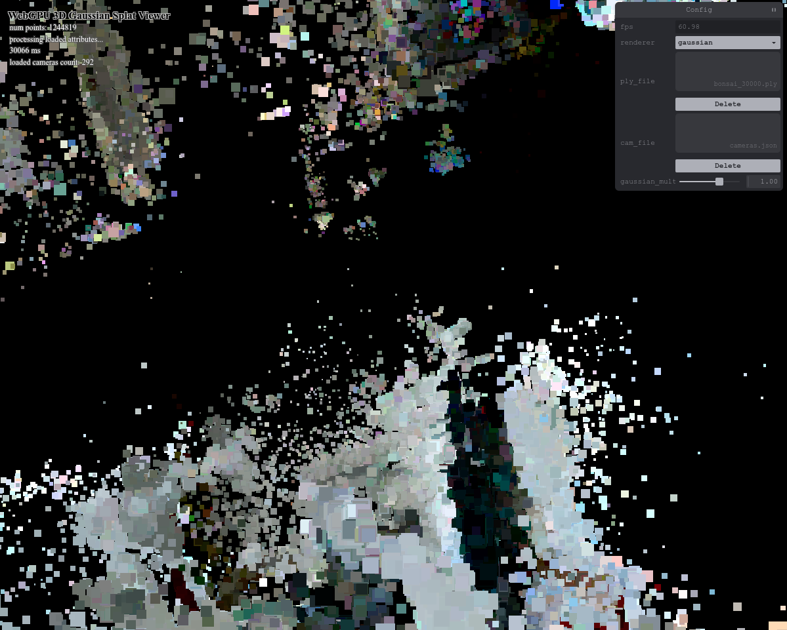
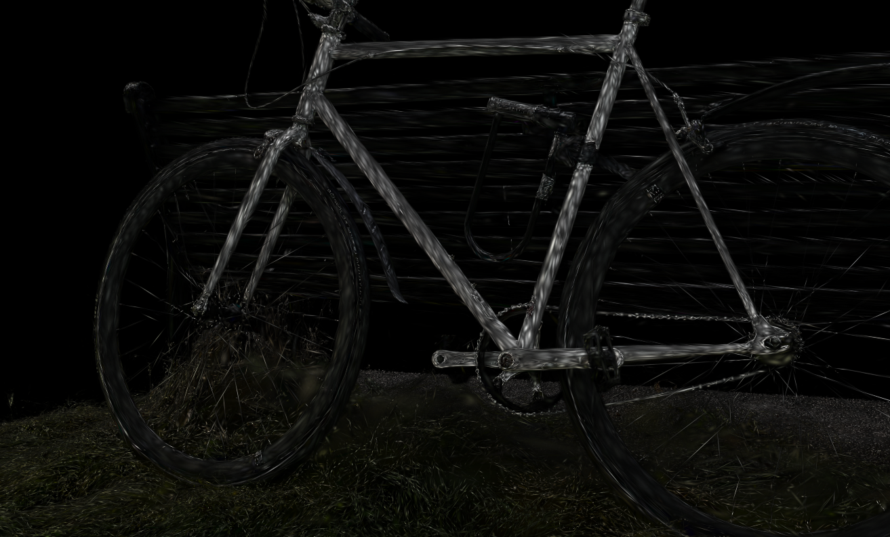

# Project5-WebGPU-Gaussian-Splat-Viewer

**University of Pennsylvania, CIS 565: GPU Programming and Architecture, Project 5**

* Joshua Smith
  * [LinkedIn](https://www.linkedin.com/in/joshua-smith-32b165158/)
* Tested on: Ubuntu 20.04, Ryzen 9 3900x @ 4.6GHz, 24GB RTX 4090 (Personal)
### Live Demo (Click image for online demo)
You need to download scene/camera files available [here](https://drive.google.com/drive/folders/1UbcFvkwZhcdnhAlpua7n-UUjxDaeiYJC?usp=sharing)

### Demo Video

### README

Features Implemented:
* Point Cloud Renderer: Render a set of points in the scene.

* Gaussian Splatting Renderer: Given a large set of 3D gaussians, with spherical harmonic coloring, opacity, position and covariance, render in the scene. (see above examples)

How Gaussian Splatting Rendering is achieved:
* First, calculate all 3D gaussians 3D covariance and positions in the camera frame
* Cull (remove) gaussians which do not appear in the frame.
* Project, using the first-order Jacobian approximation, the 3D gaussians into 2D camera space.
* Calculate the gaussian color with spherical harmonic equations and provided gaussian coefficients. 
*  Render pixel color within gaussian tiles (which enclose >97% of the pdf) according to the 2D gaussian pdf taken from the previous projection.

### Performance Analysis
 * Compare your results from point-cloud and gaussian renderer, what are the differences?

 The point cloud renderer only has to make one shader call, whereas the gaussian renderer needs to first run a preprocessing shader, then a radix sort, then finally a render shader. This generally causes the gaussian renderer to run slower. However, the Gaussian renderer is also doing slower computation within the shader. The preprocessing shader uses atomic add to assemble the list of 2d gaussians(splats) which reduces parallelism and increases runtime. Additionally, which transparent blending, the fragment shader has to draw many gaussians which overlap, causing more operations per pixel and slower runtime. 

* Does view frustum culling provide a performance improvement? Why do you think this is?

Frustum Culling significantly improves performance. For the smaller environments, like Bonsai, the effect is negligible, but is noticeable in more complex environments like the playroom scene. Additionally, in environments such as the bike environment where all of the gaussian are likely enclosed within the viewing frustum, atomic adds are only rearranging the splat/gaussian order and not decreasing the size of the render buffer for the render shader. However, for scenes that wrap around like the playroom scene, A large portion of gaussians will often be culled, improving performance. 

* Does the number of Gaussians affect performance? Why do you think that is?

Increasing the number of gaussians decreases runtime. This is due to a larger number of Gaussians needing to be preprocessed and similarly a larger number of splats having to be rendered. Regardless, the least-pleasent effect of larger scenes is initial load time. For very complex scenes, like the playroom scene, it takes about a minute before the scene is loaded and rendering can begin. 

### A Collection of mishaps/bloopers and their causes:

Neglecting to flip the y axis of NDC in rendering shader:

Reading in the covariance rotation matrix transposed:

Neglecting z-axis culling (Tiles on top are behind camera):

Applying the alpha scalar to both the color and the rgba alpha value. Interestingly, this shows the makeup gaussians very clearly.

### Credits

- [Vite](https://vitejs.dev/)
- [tweakpane](https://tweakpane.github.io/docs//v3/monitor-bindings/)
- [stats.js](https://github.com/mrdoob/stats.js)
- [wgpu-matrix](https://github.com/greggman/wgpu-matrix)
- Special Thanks to: Shrek Shao (Google WebGPU team) & [Differential Guassian Renderer](https://github.com/graphdeco-inria/diff-gaussian-rasterization)
