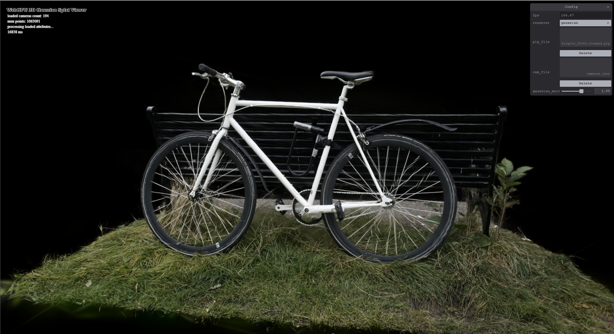
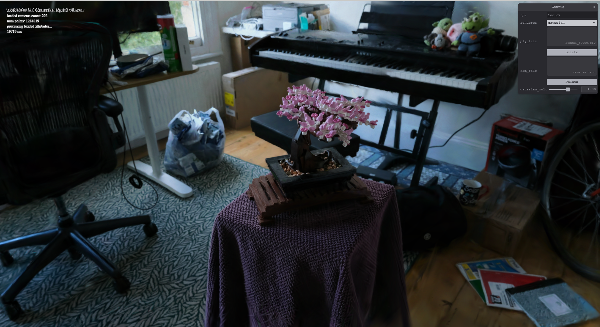

**University of Pennsylvania, CIS 565: GPU Programming and Architecture, Project 5 - WebGPU Gaussian Splat Viewer**

* Yin Tang
  * [Linkedin](https://www.linkedin.com/in/yin-tang-jackeyty/), [Github](https://github.com/JackeyTY), [Personal Website](https://jackeytang.com/)
* Tested on: Google Chrome 130.0 on Windows 11 Pro, AMD Ryzen 9 7950X @ 5.00GHz 64GB, NVIDIA GeForce RTX 4090 24GB (personal desktop)

 

### Overview

In this project, I implemented a **3D Gaussian Splat Viewer** using **WebGPU**, which is based on the paper [3D Gaussian Splatting for Real-Time Radiance Field Rendering](https://repo-sam.inria.fr/fungraph/3d-gaussian-splatting/). Online interactive [demo](https://www.jackeytang.com/WebGPU-Gaussian-Splat-Viewer/), remember to download scene files first. 

**Gaussian Splatting** is a novel technique in computer graphics and neural rendering that represents a scene or object using a collection of 3D Gaussian functions instead of traditional polygonal meshes or voxel grids. Each Gaussian, or "splat," has a position, size, orientation, and opacity, defining a smooth, continuous volume that approximates the underlying surface or appearance. This approach allows for efficient rendering, as the splats can be rasterized quickly, and their smooth nature helps reduce aliasing artifacts. Gaussian splatting is particularly well-suited for applications in real-time rendering, neural radiance fields (NeRFs), and point-based rendering, where it offers a compact and differentiable representation. By leveraging GPU acceleration, it enables high-quality rendering with fewer computational resources, making it a promising alternative for interactive graphics, virtual reality, and dynamic scene representations.

 

### Performance Analysis

- **Compare your results from point-cloud and gaussian renderer, what are the differences?**

​	Point-cloud is much easier to draw since only individual points are rendered, whereas gaussian splats render consists of more computation in the computer and render passes, which takes comparably large amount of time. On the other hand, the quality of the image rendered by the gaussian render is significantly better than that of point-cloud.

- **For gaussian renderer, how does changing the workgroup-size affect performance? Why do you think this is?**

​	Since the maximum total number of invocations per workgroup is 256, we can only decrease the workgroup size in the x-dimension, which results is worse performance since more workgroups need to be dispatched and less utilization.

- **Does view-frustum culling give performance improvement? Why do you think this is?**

​	It does improve the performance by around 5%, which is because we don't need to process out-of-bound splats so less computation and draw calls, but given the size of the scene, it is not evident.

- **Does number of guassians affect performance? Why do you think this is?**

​	As the number of gaussians, which is the upper bound for draw invocations, the performance decreases as more computation and draw calls need to be processed.
