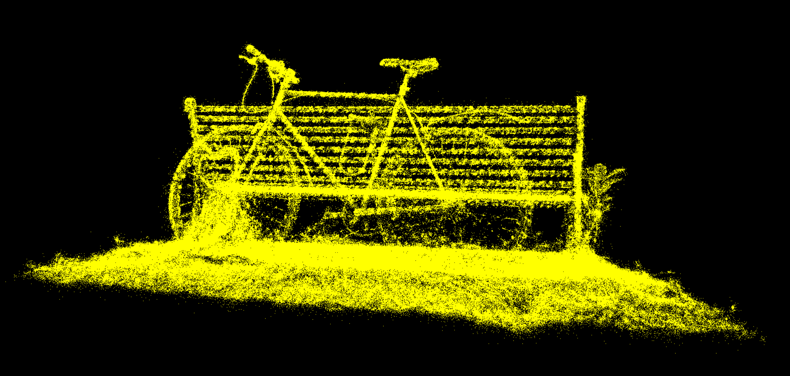
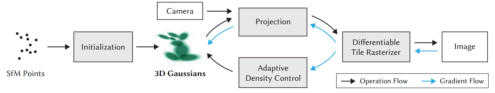

# Project5-WebGPU-Gaussian-Splat-Viewer

**University of Pennsylvania, CIS 565: GPU Programming and Architecture, Project 5**

* [Zixiao Wang](https://www.linkedin.com/in/zixiao-wang-826a5a255/)
* Tested on: Google Chrome Version 130.0. on
  Windows 11, i7-14700K @ 3.40 GHz 32GB, GTX 4070TI 12GB  4K Monitor (Personal PC)

### Live Demo

[Live Demo](https://lanbiubiu1.github.io/Project5-WebGPU-Gaussian-Splat-Viewer/)

### Demo Video/GIF

### Introduction
| Point-Cloud           | Gaussian Splat           |
|-----------------------|--------------------------|
|  |   |

In this Project, I implemented the 3D Gaussian Splat Viewer. The entire project is based on [3D Gaussian Splatting
for Real-Time Radiance Field Rendering](https://repo-sam.inria.fr/fungraph/3d-gaussian-splatting/).
To start off, we need to create a point_cloud shader to cluster the points based on the scene input .ply file. After that, the preprocess shader will read the point cloud data as splats and transfer their position into the screen space. Then, radix sort is applied to sort the splats by their screen space position and depth. In the end, the processed data are fed back into Gaussian splat to render the points in the scene in real time.

### Performance Analysis

#### Difference between Point-Cloud and Gaussian Renderer
The Point-Cloud image represents a point-cloud rendering, which shows the bicycle and bench represented by numerous distinct points. Each point in the cloud contributes to a sampled representation of the scene. The level of detail is sparse, especially at the edges, and some structure is lost due to the gaps between points, especially on finer details like spokes and the texture of the grass. The Gaussian renderer represents the scene with significantly fewer gaps, generating a much more filled and realistic depiction. This is due to representing each point as a Gaussian splat rather than a single pixel, allowing for smoother boundaries and a more cohesive structure. This representation results in better-defined shapes and surfaces, providing a higher fidelity to the original scene.

#### Changing Workgroup Size Affects Performance
Changing the workgroup size directly affects the efficiency of the compute shader execution on the GPU. Workgroup size determines how many threads are used to process a specific task. The default setting size on my machine has the best performance. Either higher or lower the workgroup size can lead to worse performance. I think it is because of the inefficiencies of many wasted computations. And smaller workgroup size  results in underutilization of GPU cores since fewer threads are running in parallel. 

#### Utilization of View-Frustum Culling to Performance Improvement
View-frustum culling improves performance by reducing the number of objects that need to be processed and rendered by the GPU. It essentially removes all points, quads, or objects that are outside the visible region (the frustum). However, as the current testing scene is relatively small, it does not really benefit from View-Frustum Culling. Instead, it might lead to some unnecessary computations. Ideally, for large scenes with large view space, the View-Frustum Culling will largely improve the performance.

#### Number of Guassians to Performance
Yes, the Number of Gaussians Affects Performance. The more Gaussians used, the more computations the GPU has to perform. Each Gaussian requires resources for rendering—whether it's calculating the size, position, or color—so increasing the number of Gaussians will linearly increase the GPU workload. More Gaussians mean more memory reads/writes and increased calculations per frame. This impacts both the GPU’s memory bandwidth and compute capacity. If the GPU is overloaded with too many Gaussians, it could lead to increased render times and drops in frame rate.

### Credits

- [Vite](https://vitejs.dev/)
- [tweakpane](https://tweakpane.github.io/docs//v3/monitor-bindings/)
- [stats.js](https://github.com/mrdoob/stats.js)
- [wgpu-matrix](https://github.com/greggman/wgpu-matrix)
- Special Thanks to: Shrek Shao (Google WebGPU team) & [Differential Gaussian Renderer](https://github.com/graphdeco-inria/diff-gaussian-rasterization).
- [Blending code reference](https://webgpufundamentals.org/webgpu/lessons/webgpu-transparency.html)
- [indirect_draw](https://developer.mozilla.org/en-US/docs/Web/API/GPURenderPassEncoder/drawIndirect)
