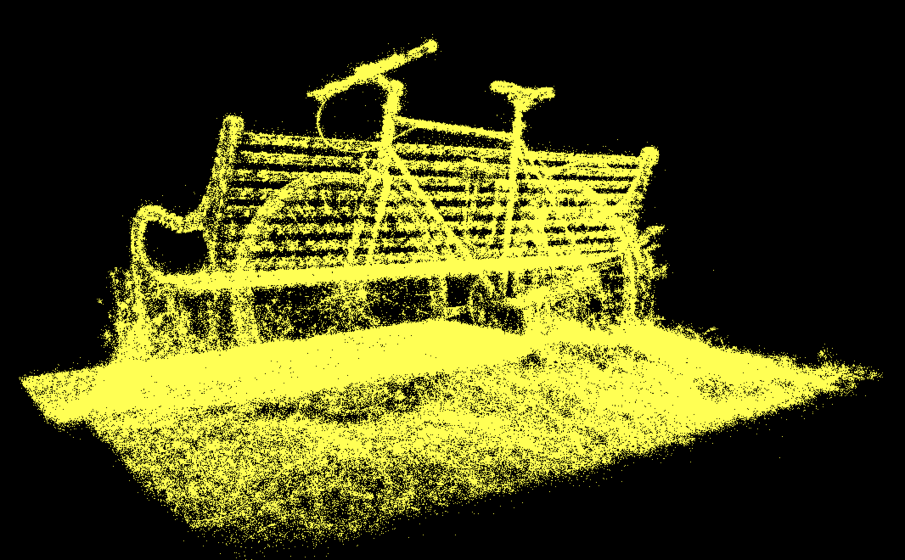

WebGPU Gaussian Splat Viewer
============================

**University of Pennsylvania, CIS 5650: GPU Programming and Architecture: Project 5**

* Dominik Kau ([LinkedIn](https://www.linkedin.com/in/dominikkau/))
* Tested on: (TODO) **Google Chrome 222.2** on
  Windows 22, i7-2222 @ 2.22GHz 22GB, GTX 222 222MB (Moore 2222 Lab)

## Live Demo

[Click here to check out my implementation!](https://domino0o.github.io/Project5-WebGPU-Gaussian-Splat-Viewer/)
You'll need some trained gaussian splat input data.

## Demo Video

TODO!!

## Overview

Gaussian splatting is a technique for reconstructing a 3D scene from images.
The method consists of a training period during which 3-dimensional Gaussian distributions are placed around the scene and optimized to best capture the given image data set.
In this phase the "nice" mathematical properties of a Gaussian distribution can be used to calculate gradients with respect to the target variables such as position, color and size of the Gaussian.
Thus, gradient based optimization techniques can be used.

Afterwards the camera can be moved freely throughout the reconstructed scene.
This allows the synthesis of images from new perspectives or videos that can be recorded in real-time with the methods presented in [this paper](https://repo-sam.inria.fr/fungraph/3d-gaussian-splatting/).
This project implements a renderer to display a scene consisting of 3D Gaussians after having been trained.

## Features

### Point Cloud Renderer

The point cloud renderer is a simple visualization of the Gaussians that are present in the dataset.
Each visible Gaussian is displayed as a point placed in its center.

### Gaussian Renderer

The main feature of this project.
The Gaussian renderer extracts the information from the given dataset and - next to position - reconstructs color (through spherical harmonics) and size of the Gaussians.
The reconstruction of information takes place in a preprocessing compute shader before the render pipeline is carried out.
A simple view-frustum culling is used to reduce the computations in the render pass.
The final rendering pipeline employs alpha blending to composite the Gaussians into an image.

### Half Precision Floating Point Optimization

This optimization feature changes the preprocessing compute shader to operate on half precision floating point numbers.
This allows for a smaller memory footprint - instead of 32 bits, only 16 bits are needed.
Moreover, modern GPUs can run operations of half precision floats significantly faster.
Not all computations are carried out using 16-bit floats, as some mathematical operations need the higher accuracy to ensure an accurate result without artifacts.

The following images show the very minor visual differences.

## Performance Analysis

### Comparison Between Point Cloud and Gaussian Renderer

### Influence of Workgroup Size

### Influence of View-Frustum Culling

### Influence of Number of Gaussians

* Compare your results from point-cloud and gaussian renderer, what are the differences?
* For gaussian renderer, how does changing the workgroup-size affect performance? Why do you think this is?
* Does view-frustum culling give performance improvement? Why do you think this is?
* Does number of guassians affect performance? Why do you think this is?

### Credits

- [Vite](https://vitejs.dev/)
- [tweakpane](https://tweakpane.github.io/docs//v3/monitor-bindings/)
- [stats.js](https://github.com/mrdoob/stats.js)
- [wgpu-matrix](https://github.com/greggman/wgpu-matrix)
- Special Thanks to: Shrek Shao (Google WebGPU team) & [Differential Guassian Renderer](https://github.com/graphdeco-inria/diff-gaussian-rasterization)
