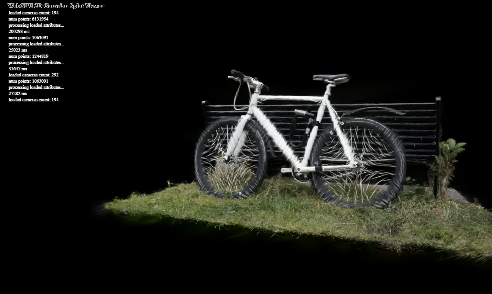

# Project5-WebGPU-Gaussian-Splat-Viewer

**University of Pennsylvania, CIS 565: GPU Programming and Architecture, Project 4**

* MANVI AGARWAL
  * [LinkedIn](https://www.linkedin.com/in/manviagarwal27/)
* Tested on: Windows 11, AMD Ryzen 5 7640HS @ 4.30GHz 16GB, GeForce RTX 4060 8GB(personal)

### Live Demo

### Demo Video/GIF

[]

### Credits

- [Vite](https://vitejs.dev/)
- [tweakpane](https://tweakpane.github.io/docs//v3/monitor-bindings/)
- [stats.js](https://github.com/mrdoob/stats.js)
- [wgpu-matrix](https://github.com/greggman/wgpu-matrix)
- Special Thanks to: Shrek Shao (Google WebGPU team) & [Differential Guassian Renderer](https://github.com/graphdeco-inria/diff-gaussian-rasterization)
