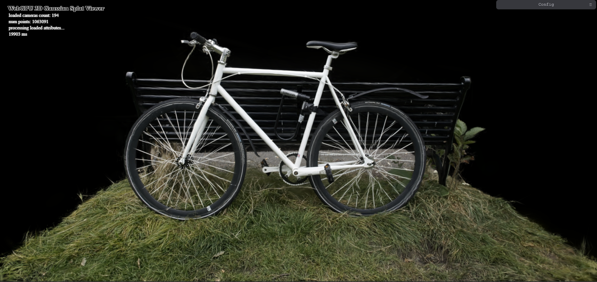
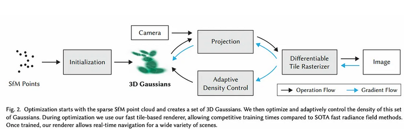

# Project5-WebGPU-Gaussian-Splat-Viewer

**University of Pennsylvania, CIS 565: GPU Programming and Architecture, Project 4**

* ADITHYA RAJEEV
  * [LinkedIn](https://www.linkedin.com/in/adithyar262/)
* Tested on: Windows 11, i7 13th Gen @ 2.40GHz 16GB, GeForce RTX 4050 8GB (Personal)

# 3D Gaussian Splatting Renderer

This project implements a 3D Gaussian Splatting renderer based on the paper "3D Gaussian Splatting for Real-Time Radiance Field Rendering" [[1]](https://repo-sam.inria.fr/fungraph/3d-gaussian-splatting/). It utilizes WebGL and leverages GPU parallelism for efficient rendering of complex scenes represented by Gaussian splats.

**Features:**

  - **Gaussian Splatting:** Implements the core algorithm for rendering 3D scenes using Gaussian splats.
  - **View Frustum Culling:** Optimizes rendering performance by discarding Gaussians outside the view frustum.
  - **Depth Sorting:** Sorts Gaussians by depth to ensure correct occlusion and transparency.
  - **Spherical Harmonics Lighting:** Uses spherical harmonics coefficients to evaluate color based on view direction.
  - **Interactive Controls:** Allows users to explore the scene with camera controls.

### Live Demo

[Live Demo](https://adithyar262.github.io/Project5-WebGPU-Gaussian-Splat-Viewer)

### Demo Video/GIF

## What is Gaussian Splatting?

Gaussian splatting is a technique for rendering 3D scenes by representing objects as a collection of Gaussian functions. Each Gaussian function, or "splat," is defined by its position, orientation, scale, and color. By blending these splats together, complex shapes and appearances can be recreated.

**Advantages of Gaussian Splatting:**

  - **Efficient Representation:** Gaussian splats can compactly represent complex shapes and appearances.
  - **Real-time Rendering:** The rendering process can be highly parallelized and optimized for real-time performance.
  - **View-dependent Effects:** Gaussian splatting can accurately capture view-dependent effects like lighting and reflections.

**How Gaussian Splatting Works:**

1.  **Scene Representation:** The 3D scene is represented as a set of Gaussian splats.
2.  **Splatting:** Each splat is projected onto the screen as a 2D ellipse.
3.  **Blending:** The splats are blended together based on their depth and opacity to create the final image.

**Performance Analysis:**

  - **Point Cloud vs. Gaussian Renderer:** 

    * **Visual Quality:** The Gaussian renderer produces significantly smoother and more visually appealing results than the point cloud renderer. Point clouds simply display individual points, leading to a sparse and disconnected representation.  Gaussian splats, on the other hand, effectively interpolate the surface between points, resulting in a continuous and more realistic appearance. They also inherently capture view-dependent effects like lighting and reflections, which are absent in a basic point cloud rendering.

    * **Data Representation:** Gaussian splats offer a more efficient representation of the scene.  They can encode surface orientation and appearance information within each splat, allowing for a more compact representation compared to storing individual points and their attributes.

  - **Workgroup Size:** 

    * **GPU Occupancy:** Increasing the workgroup size generally improves performance up to an optimal point. This is because larger workgroups allow for better utilization of GPU compute units, increasing occupancy and reducing idle time. Each workgroup is scheduled on a compute unit, and having more threads per workgroup maximizes the parallel processing capacity.

    * **Memory Contention:** However, excessively large workgroups can lead to decreased performance. This is due to increased memory access contention, where multiple threads within the same workgroup try to access the same memory locations simultaneously. This contention can cause delays and stall the execution, negating the benefits of increased parallelism. The optimal workgroup size depends on the specific GPU architecture and the complexity of the rendering task.

  - **View Frustum Culling:** 

    * **Reduced Computation:** View frustum culling provides a significant performance improvement. By discarding Gaussians that lie outside the camera's view frustum, we drastically reduce the number of splats that need to be processed in subsequent stages of the rendering pipeline. This leads to fewer computations in transformations, depth sorting, and rasterization, resulting in a noticeable speedup.

    * **Early Rejection:** Culling is an early rejection step that prevents unnecessary work. Without it, all Gaussians would go through the entire pipeline even if they don't contribute to the final image. This optimization is particularly crucial in scenes with a large number of splats, where the computational cost savings can be substantial.

  - **Number of Gaussians:** 

    * **Increased Workload:** As the number of Gaussians increases, the rendering performance decreases. This is simply due to the increased workload on the GPU. More splats require more computations for transformation, culling, sorting, and rasterization. The memory requirements also increase, potentially leading to more data transfers and cache misses.

    * **Bottlenecks:**  A higher number of Gaussians can exacerbate bottlenecks in the rendering pipeline. For example, depth sorting becomes more computationally expensive with more splats, potentially limiting the overall frame rate. The specific performance impact depends on the scene complexity, GPU capabilities, and the efficiency of the rendering algorithm.

## Bloopers! 

Everyone loves a good blooper reel! Here's a glimpse of some of the hilarious (and sometimes frustrating) glitches encountered during the development of this project. From Gaussians going rogue to unexpected visual effects, these bloopers showcase the challenges and triumphs of bringing this renderer to life.

**Resources:**

  - **3D Gaussian Splatting Paper:** [https://repo-sam.inria.fr/fungraph/3d-gaussian-splatting/](https://repo-sam.inria.fr/fungraph/3d-gaussian-splatting/)
  - **Gaussian Splatting Notes:** [https://github.com/kwea123/gaussian\_splatting\_notes](https://github.com/kwea123/gaussian_splatting_notes)
  - **Spherical Harmonics Post:** [https://beatthezombie.github.io/sh\_post\_1/](https://beatthezombie.github.io/sh_post_1/)