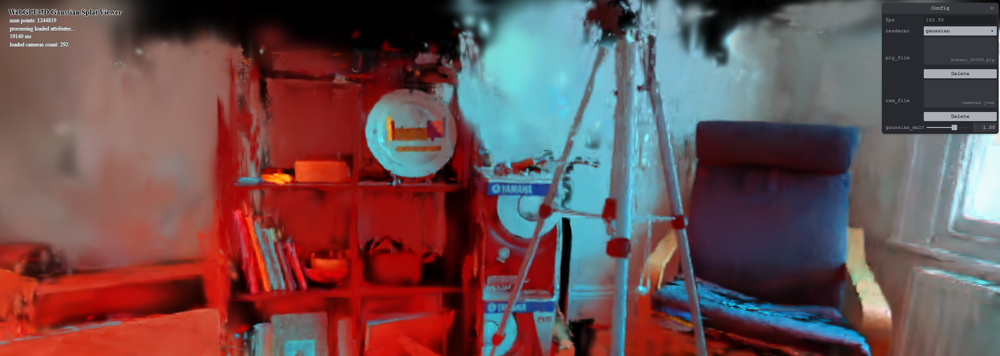

# Project5-WebGPU-Gaussian-Splat-Viewer

**University of Pennsylvania, CIS 565: GPU Programming and Architecture, Project 5**

* CARLOS LOPEZ GARCES
  * [LinkedIn](https://www.linkedin.com/in/clopezgarces/)
  * [Personal website](https://carlos-lopez-garces.github.io/)
* Tested on: Windows 11, 13th Gen Intel(R) Core(TM) i9-13900HX @ 2.20 GHz, RAM 32GB, NVIDIA GeForce RTX 4060, personal laptop.

### [Live Demo](http://carlos-lopez-garces.github.io/Penn-CIS-5650-Project5-WebGPU-Gaussian-Splat-Viewer)

### Demo Video/GIF

| Bonsai | Bicycle |
|----------|----------|
|    |    |
| **Truck** | **Train** |
|    |    |

## WebGPU Gaussian Splat and Point Cloud Viewer

This project implements a viewer and renderer for point clouds and Gaussian splats. The renderer implements the rasterizer of the paper "3D Gaussian Splatting
for Real-Time Radiance Field Rendering" ([paper website](https://repo-sam.inria.fr/fungraph/3d-gaussian-splatting/)).

The viewer handles well many of the common scenes typically used by academic papers to present their results.

| Bonsai | Bicycle |
|----------|----------|
|    |    |
| **Truck** | **Train** |
|    |    |

### Features

- Real-Time Point Cloud Rendering: Visualize dense point cloud data from .ply files.

- Gaussian Splatting: Reconstruct the radiance field of a scene from its point cloud using Gaussian Splatting.

- Camera Controls: Pan, zoom, and rotate for detailed examination of Gaussian splats and point clouds.

A point cloud is the main input to the Gaussian splatting rendering process.

| Bonsai | Bicycle |
|----------|----------|
|    |    |
| **Truck** | **Train** |
|    |    |

### Gaussian Splat Preprocesing

The preprocessing step transforms point data into splat representations for rendering by calculating 2D covariances, projecting spherical-harmonics-based color, and organizing/sorting splats for rendering based on depth.

- Frustum culling checks if the splat falls within the visible area. Culling early reduces unnecessary computations for off-screen points.

- The Gaussian’s scale and rotation are transformed into a 3D covariance matrix. This 3D covariance is projected to 2D to represent screen-space influence, helping to control the splat’s shape based on viewpoint.

- Conic parameters are derived from the 2D covariance, resulting in a conic equation that approximates Gaussian distribution across x and y directions. Eigenvectors of the covariance provide major and minor axes, which are scaled to determine the Gaussian’s radius on the screen.

- Spherical harmonics coefficients approximate lighting effects for each Gaussian based on its orientation.

### Gaussian Splat Rendering

For each splat, six vertices are generated to define a bounding quadrilateral in screen space. These vertices form a rectangle around each splat, with edges aligned based on the splat’s screen-space radius.

In the fragment shader, the screen-space offset from the splat’s center to the fragment position is computed. A linear combination with the coefficients of a conic form is used to obtain the exponent by which the splat's opacity decays. Its color is blended with the splat's opacity, which finalizes the reconstruction of the radiance field.

### Performance Analysis

The following table and chart show a few statistics about each of the scenes that were tested and the frames per second range achieved by the viewer for both the point cloud and the Gaussian splats. Because the process to render Gaussian splats is much more involved (preprocessing, data transfer, more complex computations per vertex and fragment), they consistently reach a much lower FPS. Also, FPS decreases with the number of points in the point cloud. FPS ranges are very wide and depend significantly on the camera angle; here they are shown from the default camera angle of the respective scene.

Observe also that the size of the point cloud has an effect on FPS, but it's not the only factor to consider (note that the truck scene is twice the size of the train scene and they have comparable FPS ranges in the Gaussian splat case). In general, as the number of Gaussians increases, so does the FPS; the preprocessing step processes each of them (culled excluded), so FPS increases proportional. But as I said before, it's not the only factor; I investigate this phenomenon further below.

| Scene  | Points  | Time (ms) | Point Cloud FPS | Gaussian Splat FPS |
|--------|---------|-----------|-----------------|--------------|
| Bonsai | 1,244,819 | 19,597    | 160         | 84       |
| Bicycle| 1,063,091 | 25,271    | 150-181     | 54-85    |
| Train  | 1,026,508 | 15,285    | 121-255     | 32-45    |
| Truck  | 2,541,226 | 40,027    | 166-175     | 32-41    |

Frustum culling is gives a very modest improvement in FPS, cutting down on the number of Gaussians processed per frame. In this example, where I've zoomed into Bicycle scene, leaving some points out of view, 15 fps was registered without frustum culling compared to 21 with frustum culling. Since the preprocessing compute shader runs simultaneously on the GPU, perhaps the work group size in this case (256) is such that Gaussians that are otherwise culled are processed simultaneously with the visible ones, so that both with and without culling the workgroups finish roughly in the same time.

Work group size has a two-fold effect: (1) render quality is optimal for a group size of 256 (sizes 64, 128, and 512 result in artifacts); (2) the FPS range reached with each of the sizes varies, with size 256 resulting in the highest FPS. A work group size of 256 allows for a high degree of parallelism, which is crucial for achieving high FPS. Smaller sizes might not leverage the full parallel processing power of the GPU, while larger sizes might introduce overhead that reduces performance.

| Work Group Size | FPS Range |
|-----------------|-----------|
| 256             | 51 - 84   |
| 128             | 11 - 71   |
| 64              | 14 - 32   |

### Artifacts During Development

From not indexing the spherical harmonics coefficients correctly.

Flickering.

### Credits

- [Vite](https://vitejs.dev/)
- [tweakpane](https://tweakpane.github.io/docs//v3/monitor-bindings/)
- [stats.js](https://github.com/mrdoob/stats.js)
- [wgpu-matrix](https://github.com/greggman/wgpu-matrix)
- Special Thanks to: Shrek Shao (Google WebGPU team) & [Differential Guassian Renderer](https://github.com/graphdeco-inria/diff-gaussian-rasterization)
