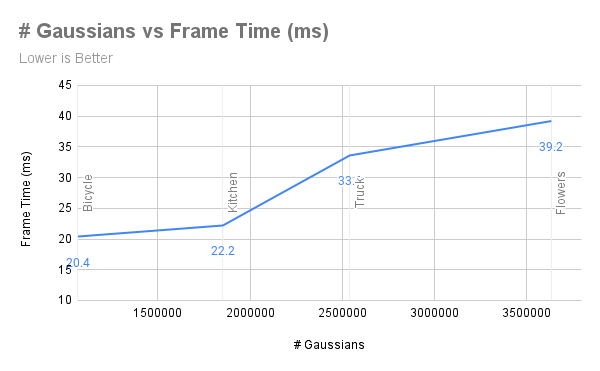

# Web-based Gaussian Splat Viewer

**University of Pennsylvania, CIS 565: GPU Programming and Architecture, Project 4**

* Rahul Aggarwal
  * [LinkedIn](https://www.linkedin.com/in/rahul-aggarwal-32133a1b3/)
* Tested on: Windows 11, i7-12700H @ 2.3GHz, RTX 3050 Ti Laptop 4GB (Personal)

## Live Demo

[Live Demo](http://rahulaggarwal965.github.io/CIS5650-Project-5-WebGPU-Gaussian-Splat-Viewer)

## Demo Video/GIF

## Methodology

Gaussian splatting is a recent technique in neural scene representation that models 3D scenes using Gaussian ellipsoids rather than relying on volumetric grids, as in NeRF (Neural Radiance Fields). Gaussian splatting allows for faster rendering times and efficient handling of complex scenes with fewer computations. Here’s a breakdown of the methodology, along with a contrast to NeRF:

### Scene Representation
* Gaussian splatting represents a scene as a set of 3D Gaussian ellipsoids distributed in space, each with a specific position, orientation, covariance (defining the ellipsoid's shape), and color.
* Unlike NeRF, which densely samples points within a scene using volumetric grids, Gaussian splatting uses a collection of 3D Gaussians to approximate the scene geometry, which allows for a sparse and memory-efficient representation.

### Rendering Pipeline
* Each Gaussian is rendered with splatting techniques, which involve projecting the 3D ellipsoids onto a 2D plane. Each Gaussian contributes to the final image based on its size, opacity, and color.
* The rendering process can use hardware acceleration (e.g., GPUs) to efficiently rasterize each Gaussian into the target image, enabling faster rendering compared to the volumetric raymarching required in NeRF.

### Advantages in Real-Time Rendering:
* Gaussian splatting is highly efficient, often enabling real-time or near-real-time rendering, making it well-suited for applications like virtual reality, gaming, or interactive 3D scene exploration.
* Due to its sparse representation, Gaussian splatting requires less memory and computational overhead than NeRFs, especially for scenes with significant empty space or low-density details.

### Optimization and Training:
* Gaussian splatting methods can either learn the parameters of the Gaussians directly (i.e., their positions, orientations, and colors) from a set of images or initialize them using 3D scans or point clouds.
* Additional refinement processes can optimize Gaussian parameters to improve rendering fidelity, similar to the iterative optimization used in NeRF training.

## Comparison with NeRF

### Density and Sampling:
* NeRF densely samples points in 3D space to train a neural network that outputs density and color values, requiring a substantial amount of computation and training time.
* Gaussian Splatting sparsely places Gaussians in key regions, resulting in fewer data points and, thus, quicker computation.

### Training Time:
* NeRF training times are high due to the need to optimize a neural network across a large number of sampled points.
* Gaussian Splatting can be initialized with fewer parameters, making it faster to set up and train for similar visual quality.

### Rendering Time:
* NeRF rendering is slow and computationally expensive as it requires raymarching through the volume and evaluating the neural network along each ray.
* Gaussian Splatting offers faster rendering by projecting Gaussians directly, which avoids the heavy raymarching and neural evaluations, making it much more suitable for interactive applications.

## Implementation Notes
Implementing Gaussian splatting generally involves:

* Defining Gaussians in the scene with initial positions, colors, and sizes.
* Projecting Gaussians onto a 2D image plane using rasterization techniques or splatting.
* Applying blending techniques to account for overlapping Gaussians, typically involving alpha compositing or other transparency handling.
* (Optional) Refining Gaussian parameters through optimization if training from image data to improve scene accuracy.

In contrast, a NeRF implementation requires setting up a neural network, training with volumetric sampling, and raymarching at render time. Gaussian splatting’s simplicity, with its sparse Gaussians and direct rendering process, makes it a compelling alternative when speed and resource efficiency are priorities.

## Performance Analysis

### Point Cloud vs. Gaussian Splatting

Below, we show a comparison of Point Cloud rendering vs. Gaussian Splatting rendering using the default view on the bycicle scene.

| Point Cloud          | Gaussian Splatting   |
| -------------------- | -------------------- |
| 16.6 ms per frame    | 20.4 ms per frame    |
|  |  |

The image shows two renderings of a scene featuring a bicycle and a bench. On the left is a Point Cloud rendering, which represents the scene using individual points in 3D space, leading to a sparse, fragmented look with gaps in the structure. This technique is fast (16.6 ms per frame in this example) but lacks surface continuity and detail.

On the right is a Gaussian Splatting rendering, which uses Gaussian distributions to blend and smooth out the points, resulting in a more continuous and realistic appearance with smoother surfaces and textures. However, this method is slightly slower (20.4 ms per frame) due to the additional computational overhead for blending the points.

In essence, point clouds are efficient but limited in visual quality, while Gaussian splatting improves realism at a modest performance cost.

### Workgroup Size

We compare the effects of a varying workgroup size in the graph below. For reference, we used the default view of the basic bicycle for this analysis.

The graph shows that increasing the workgroup size leads to reduced frame time in Gaussian splatting. Starting at a workgroup size of 64 with a high frame time of 35.21 ms, the frame time drops to 27.03 ms at 128 and further to 20.4 ms at 256. This trend suggests that larger workgroups improve parallel processing efficiency, allowing more Gaussians to be processed simultaneously and reducing computational time. The optimal performance at a workgroup size of 256 highlights the benefits of maximizing parallelism for computationally intensive tasks like Gaussian splatting.

### View-Frustrum Culling

We compare the effect of view-frustrum culling by disabling the feature in-code and comparing average frame-times. Additionally, we zoom in to the bicycle scene to get to the scenario where view-frustrum culling is in effect.

| With View-Frustrum Culling | Without View-Frustrum Culling |
| -------------------------- | ----------------------------- |
| 90.9 ms per frame          | 248.3 ms per frame            |

The results show that **view-frustum culling** significantly improves performance in this scene. With culling enabled, the average frame time is 90.9 ms, whereas disabling culling increases the frame time to 248.3 ms. This nearly threefold increase suggests that culling effectively reduces the number of off-screen objects processed, especially when zoomed in on the bicycle, where more objects outside the view are ignored. Thus, view-frustum culling is highly beneficial in reducing computational load and enhancing rendering efficiency.

### Scene Complexity

The best proxy we have for the number of gaussians, or in other words the scene complexity, is the number of points in the scene. We disable view-frustrum culling for the test and compare scenes with differing number of points. While not an exact performance comparison, we zoom out until each scene takes relatively the same amount of screen "real-estate" and compare frame time numbers in the graph below.

The graph shows the relationship between scene complexity (measured by the number of Gaussians, or points, in the scene) and frame time (in milliseconds) when view-frustum culling is disabled. As the number of Gaussians increases, the frame time also increases, indicating that more complex scenes require more time to render.

#### Key observations:

* Initial Increase: For the "Bicycle" scene (around 1.5 million Gaussians), the frame time is relatively low at 20.4 ms. Moving to the "Kitchen" scene (~2 million Gaussians), frame time only slightly increases to 22.2 ms, suggesting the rendering system handles a moderate increase in points efficiently.
* Sharp Rise at Mid-Range Complexity: Between the "Kitchen" and "Truck" scenes (~2.5 million Gaussians), there’s a noticeable jump in frame time to 33 ms. This suggests that rendering costs increase disproportionately as the scene complexity reaches a certain threshold, likely due to memory bandwidth, cache limitations, or other hardware constraints.
* Continued Growth at Higher Complexity: For scenes with even higher complexity, like "Flowers" (~3.5 million Gaussians), the frame time continues to rise, reaching 39.2 ms. The increase is more gradual here, indicating diminishing returns on the performance cost per additional Gaussian.

Overall, the data suggests a nonlinear relationship between scene complexity and rendering time, with a substantial increase in frame time at mid-to-high complexity. This highlights the importance of managing scene complexity, especially as the number of points approaches 2.5 million, where rendering performance begins to degrade more noticeably. However, it is important to note that the area that the gaussians take on the screen seems to matter the most for rendering performance.

### Credits

- [Vite](https://vitejs.dev/)
- [loaders.gl](https://loaders.gl/)
- [dat.GUI](https://github.com/dataarts/dat.gui)
- [stats.js](https://github.com/mrdoob/stats.js)
- [wgpu-matrix](https://github.com/greggman/wgpu-matrix)
