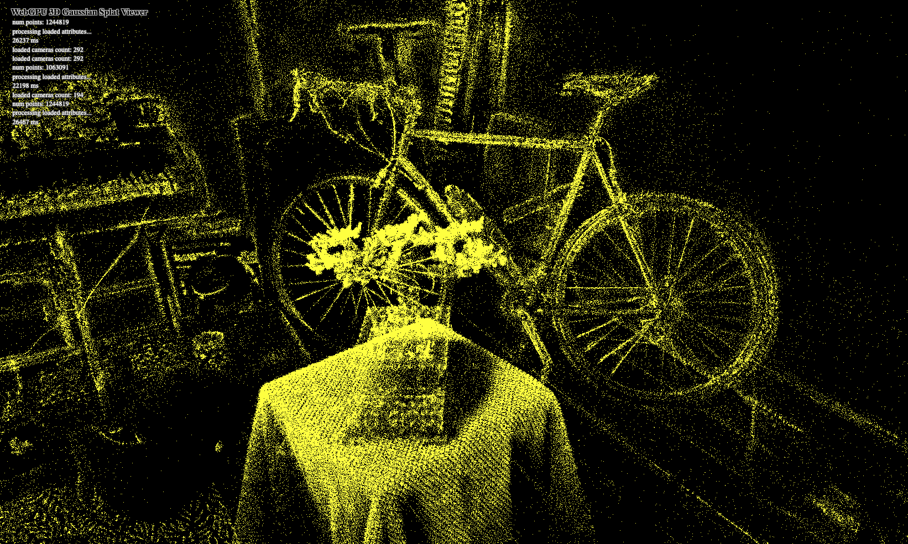

# Project5-WebGPU-Gaussian-Splat-Viewer

**University of Pennsylvania, CIS 5650: GPU Programming and Architecture, Project 3**

* Shreyas Singh
    * [LinkedIn](https://linkedin.com/in/shreyassinghiitr)
* Tested on: Apple MacBook Pro, Apple M2 Pro @ 3.49 GHz, 19-core GPU

### Live Demo

[Live Demo](https://shreyas3156.github.io/Project5-WebGPU-Gaussian-Splat-Viewer/)

Open it with any Gaussian splat input dataset.

### Demo Video/GIF

### Project Overview

#### Gaussian Splatting

Gaussian splatting is a way to draw 3D scenes by treating each point as a little “splat” instead of a triangle. Each splat is a 3D Gaussian defined by its center, shape, and color (often encoded with spherical harmonics).

This WebGPU project builds a real-time viewer for a pre-trained Gaussian scene. First, a compute pass culls off-screen Gaussians, computes each splat’s 2D position, size, and color, and builds an indirect draw command. Then a single indirect draw call runs a vertex shader to place each quad and a fragment shader to shade it using the Gaussian equation.

### Features
#### Point Cloud Rendering

This image shows a 30,000-point scan, rendered as small yellow points which are centers of as many number of Gaussians.

#### Gaussian Rendering
The image at the top of this page is rendered by transforming the aforementioned Gaussian splats into screen space, dropping the ones that lie outside the view, sorting the remaining Gaussians back-to-front, and drawing them as small quads whose opacity falls off smoothly from the center.

### Performance Analysis
#### Point-Cloud Renderer vs Gaussian Renderer Comparison
The **point-cloud renderer** simply displays individual points in 3D space, which often look sparse and disconnected, especially in regions where data is less dense. They lack fine detail and do not capture subtle lighting effects, thus appearing far less realistic. On the other hand, the **Gaussian renderer** produces a much smoother and more continuous image by placing volumetric ellipsoids at each point. These splats overlap and blend, filling in gaps and creating the appearance of solid, soft-edged surfaces. With the addition of spherical harmonics to encode color, the Gaussian renderer is able to reproduce rich and realistic shading. However, this added visual fidelity comes at the expense of performance: the Gaussian renderer requires compute such as preprocessing, frustum culling, and sorting, which slows down rendering.

#### Effect of Workgroup Size on Gaussian Renderer Performance 
Using a larger workgroup size can improve performance by better utilizing the GPU capabilities, allowing more simultaneous computation. However, if the workgroup size becomes too large, it can lead to problems like buffer overflows or inefficiency. On the other hand, using a smaller workgroup size can result in more overhead for the GPU to manage many small groups.

#### Effect of View-Frustum Culling 
View-frustum culling does provide a performance improvement, especially in larger or denser scenes. By discarding Gaussians that are outside the camera’s view early in the compute shader, the renderer avoids unnecessary processing for splats that would never be visible on the screen. The effect is most noticeable when the camera is inside a large scene or when many points fall outside the view. However, the benefit can be less noticeable in simple or small scenes where most Gaussians are visible anyway, and the overhead of the culling itself could slightly offset the gains.

#### Effect of Number of Gaussians
As the number of Gaussians increases, the performance generally decreases because the renderer must process, sort, and potentially draw more data thus leading to more computation and higher memory usage. While GPUs handle small numbers efficiently, very large numbers of Gaussians can slow down the frame rate, especially if many are visible at once.

### Credits

- [Vite](https://vitejs.dev/)
- [tweakpane](https://tweakpane.github.io/docs//v3/monitor-bindings/)
- [stats.js](https://github.com/mrdoob/stats.js)
- [wgpu-matrix](https://github.com/greggman/wgpu-matrix)
- Special Thanks to: Shrek Shao (Google WebGPU team) & [Differential Guassian Renderer](https://github.com/graphdeco-inria/diff-gaussian-rasterization)
