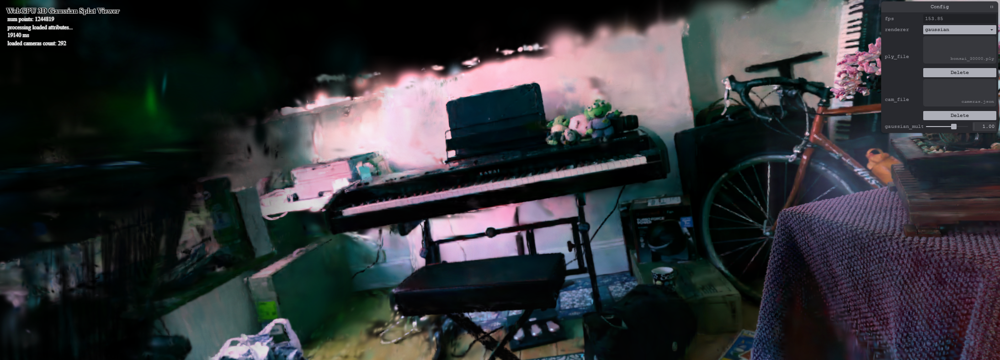

# Project5-WebGPU-Gaussian-Splat-Viewer

**University of Pennsylvania, CIS 565: GPU Programming and Architecture, Project 4**

* MANVI AGARWAL
  * [LinkedIn](https://www.linkedin.com/in/manviagarwal27/)
* Tested on: Windows 11, AMD Ryzen 5 7640HS @ 4.30GHz 16GB, GeForce RTX 4060 8GB(personal)

### Live Demo

### Demo Video/GIF

### Overview

  This project covers implementation [*3D gaussian splatting for real time radiance field rendering*](https://repo-sam.inria.fr/fungraph/3d-gaussian-splatting/3d_gaussian_splatting_high.pdf) on WebGPU. There are two renders implemented in the project :- Point cloud and Gaussian render. 
  One of the main difference in the two renders is that in gaussian renderer, a preprocess compute shader is used to to make some calculations that facilitate rendering 3D gaussian as a splat on screen space in the graphics pipeline. 

  The way I understood gaussians is that it is a cloud in 3D space whose center position, rotation, scaling and opacity is given to us. The following diagram is a good way to get intuition of a 3D gaussian.

  

  Based on the provided information of this point cloud, we can identify the region in 2D space which it will eventually impact to compute color contribution of the gaussian. Normally projecting a gaussian cloud on 2D screen would result in an ellipse but for the sake of ease, we approximate projecting it as a circle with radius. This circle is nothing but 2D splat and to render this we further approximate it as a quad circumscribing the circle. 

### Advantages of Gaussian Splatting:

- Fast real-time rendering method '
- Efficient representation of 3D space where complex shapes can be represented from group of gaussians.
- High visual quality which looks almost natural.

### Performance Analysis

**Point-cloud vs gaussian renderer**

- One main difference is in point cloud, we render point which is mean of each gaussian cloud while in gaussian we render a quad approximating a 3D gaussian projection on 2D screen.
- Indirect draw call in used in gaussian rendered because for each gaussian point, 6 vertices are drawn to make a quad.
- **Visually**, Gaussian renderer also produce more natural and continous appearances while point cloud rendered simply looks like a collection of points.

**Workgroup size impact on performance**

- Increase in workgroup size definitely allows for more speedup given num points in render pipeline are usually high enough to benefit sufficiently from parallelization.
- **Resourced contention** issues can happen as multiple threads can access shared resource like uniform data buffers at the same time which can cause higher latency 

**View-frustum culling**

- Ideally reduced computation due to early removing the gaussians which do not contribute to the scene should show some evident speedup bu since there is limitation to workgroup size in webgpu, there is not much noticeable speedup even after culling gaussian.

**Impact of number of gaussians**

- The performance tends to remain same while increasing gaussians suggesting scope of more paralleization as number of gaussians increase.
- After certain threshold value of gaussian count, the fps would typically reduce showing the bottleneck of parallelization scale in gpu.

### Bloopers

 

 I remember taking screenshot of this image as I was trying to debug gaussian splatting. I believe I would have hardcoded position to get so many splats with no blending.

 

This screenshot came when the depth passed to sorter was incorrect and blending factor wasn't computed correctly.

### Credits

- [Vite](https://vitejs.dev/)
- [tweakpane](https://tweakpane.github.io/docs//v3/monitor-bindings/)
- [stats.js](https://github.com/mrdoob/stats.js)
- [wgpu-matrix](https://github.com/greggman/wgpu-matrix)
- Special Thanks to: Shrek Shao (Google WebGPU team) & [Differential Guassian Renderer](https://github.com/graphdeco-inria/diff-gaussian-rasterization)
